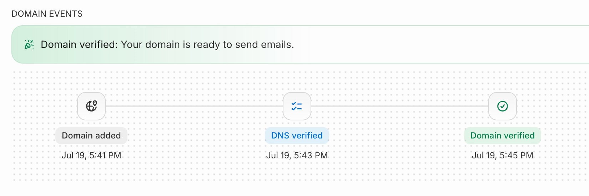

このサイトでお問い合わせフォームが絶対に必要というわけではないけれど、AstroのActionsを試してみたかったこともあり、技術の確認・キャッチアップを兼ねて実装してみた。

Astroでは、お問い合わせフォームからメールを送信する方法として、ActionsまたはAPIルートを利用できる。今回は、お問い合わせフォームから送信された内容をResend経由でメールとして受信するだけなので、Actionsを使用。

## フォームとActions

まずは、名前、メールアドレス、問い合わせ内容だけのシンプルなフォームを作成し、`src/actions/index.ts`を呼び出してサーバー側で`console.log`して動作を確認した。

```astro
// src/components/ContactForm.astro

<script>
  import { actions } from "astro:actions";

  const form = document.querySelector<HTMLFormElement>(".contact-form");

  form?.addEventListener("submit", async (event) => {
    event.preventDefault();

    const formData = new FormData(form);
    const { error } = await actions.contact(formData);

    if (error) {
      console.error(error);
      return;
    }

    console.log("送信に成功しました");
  });
</script>
```

```ts
// src/actions/index.ts

import { defineAction } from "astro:actions";
import { z } from "astro/zod";

export const server = {
  contact: defineAction({
    input: z.object({
      name: z.string().trim().max(100),
      email: z.email(),
      message: z.string().trim().min(1),
    }),

    accept: "form",
    handler: async ({ name, email, message }) => {
      console.log({
        name,
        email,
        message,
      });
      return { success: true };
    },
  }),
};
```

## Resend

Resendは3,000通/月まで無料。アカウントを作成して、ドメイン（`hayama.me`）を認証をするとCloudflareとの連携によって必要なDNSレコードも自動で追加された。Resendのダッシュボードでステータスが「Verified」になって完了。



`hayama.me`用のAPI Keyを作成して、ローカル開発環境用は`.dev.vars`に`RESEND_API_KEY=re_****`を設定。

`actions`内のhandlerをResendでメール送信するように変更。

```ts
handler: async ({ name, email, message }) => {
      // ResendのAPI keyを設定
      const apiKey = import.meta.env.RESEND_API_KEY;
      const resend = new Resend(apiKey);

      const { data, error } = await resend.emails.send({
        // 送信内容
      });
```

## SSGからSSRへ

本番環境のCloudflareにもResendのAPI Keyを設定するため、ダッシュボードの`Workers & Pages > Settings > Variables and secrets`に行くと値の追加ができない。
