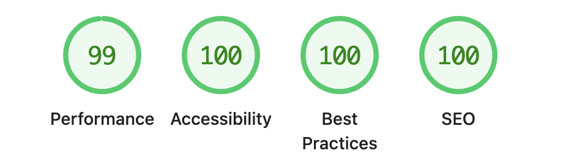

## 現状確認

昨日までに一通りの設定が終わったので、Chrome DevToolsのLighthouseでホーム（`https://hayama.me/`）のパフォーマンス（Mobile）を確認した。

- Performance: 99
- Accessibility: 95
- Best Practices: 100
- SEO: 100

Accessibilityが少し低い。

## Accessibilityの改善

Accessibilityの改善点を確認すると、日付や注釈の文字色が薄すぎることだったので、少しだけ濃くしたら100点になった。見た目はほとんど変わらないけど、こういう細かいところまで見ているんだなと思った。

## 表示速度

表示速度といえばお約束で、<a href="https://abehiroshi.la.coocan.jp/" target="_blank" rel="noopener noreferrer">阿部寛さんのホームページ</a>と比較してみた。もちろん、勝てるわけはないけど。

|項目|阿部寛|羽山和行|
|:---|---:|---:|
|Requests|5|10|
|Transferred|38.2kB|808kB|
|Resources|37kB|843kB|
|Load|74ms|215ms|

まだ改善できるところはありそうだけど、一旦はここまで。十分かな。
